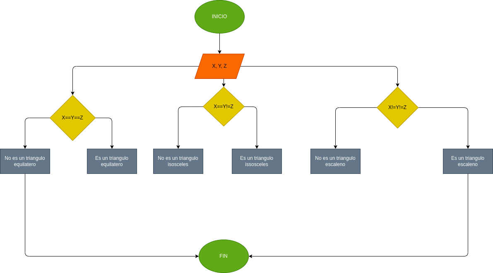

# Programa para determinar si es un triangulo, isoceles o escaleno

## Escribir un programa que lea 3 numeros positivos a,b y c, correspondientes a los lados de un triangulo; determinar si se trata de un triangulo y si este es equilatero, isoceles o escaleno. 

